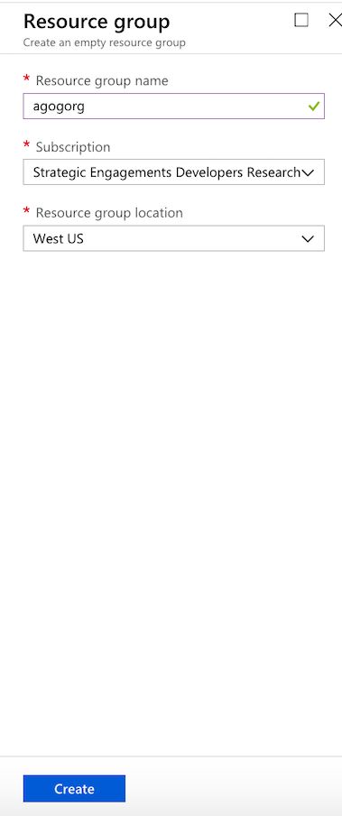
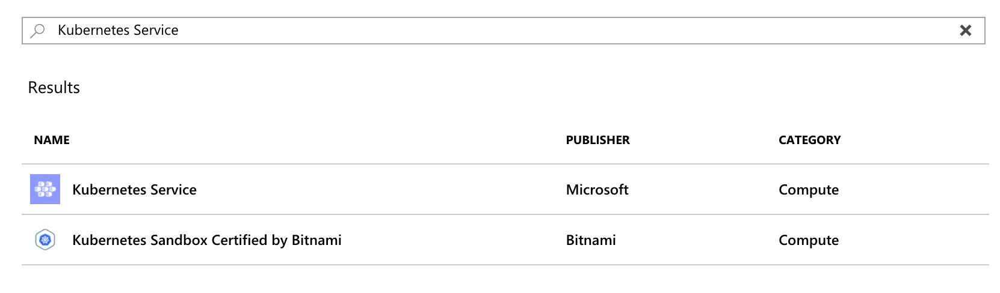
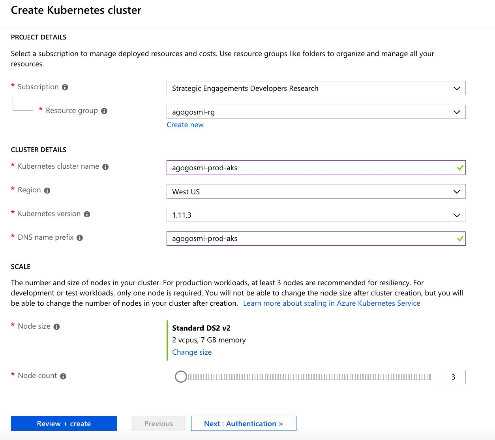
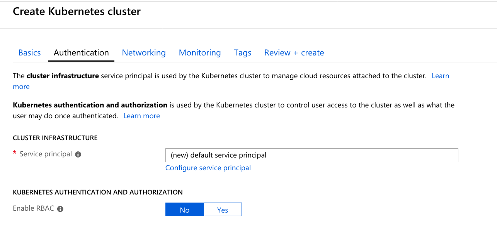
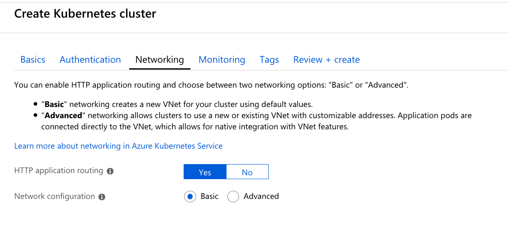
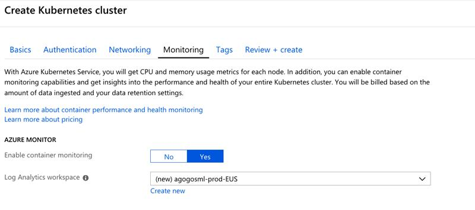
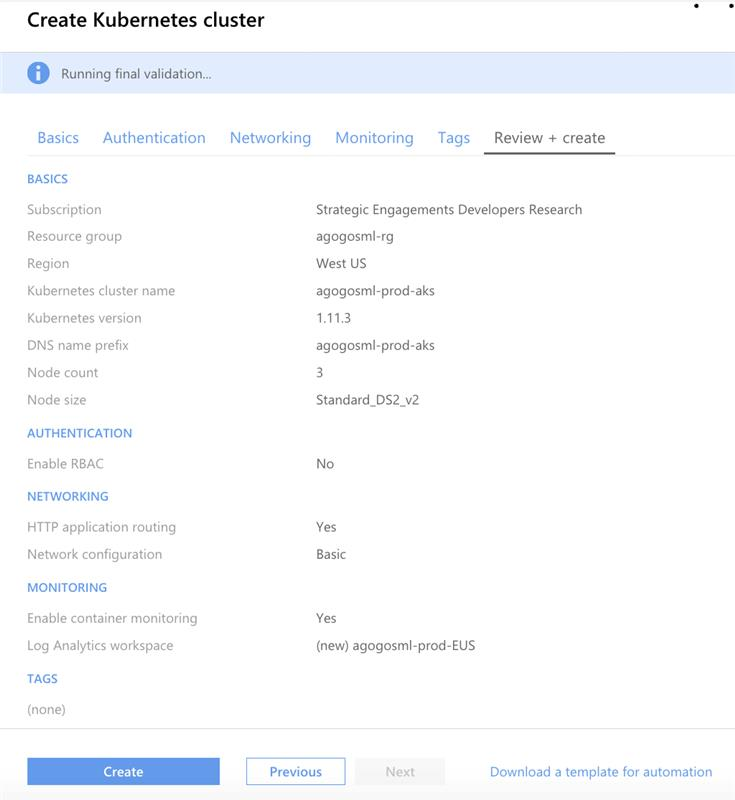
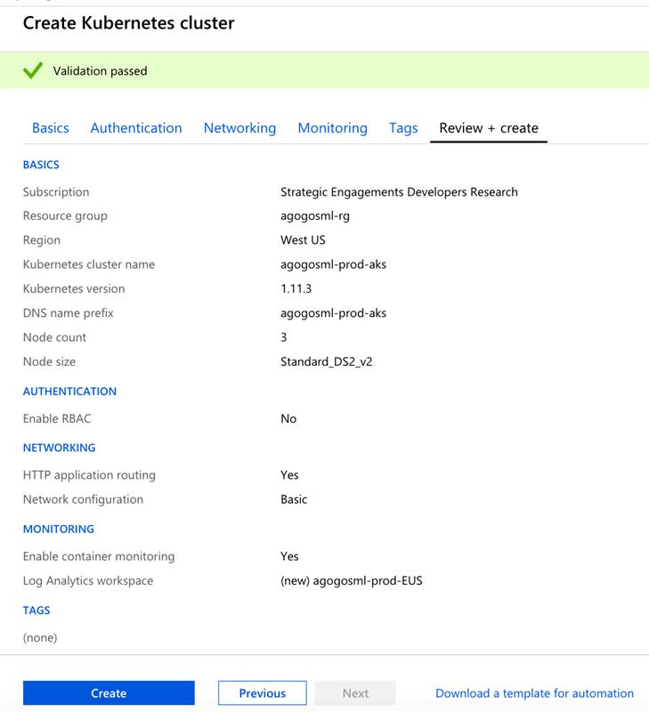

# Setup Test Environment

This page describe in details the different steps for deploying a new AKS cluster (including ACR), Azure storage and Azure Event Hub.

## Create an Azure Container Registry

Create a new Azure Container Registry that the CI/CD will use to push container images to and that Kubernetes will use to pull images from

- Create a new [Azure Container Registry](https://docs.microsoft.com/en-us/azure/container-registry/container-registry-get-started-portal#create-a-container-registry)

## Create a Kubernetes Cluster

- Create a new resource group on your subscription

- Add a new resource and search for "Kubernetes Cluster"

- Define the resource group, cluster name and DNS

- Press "Next"

  - Let Azure create a new service principal
  - Ensure Enable RBAC is disabled

- Press "Next" and leave the networking tab with the default values

- Press "Next"
  - Enable container monitoring
  - Let Azure create the workspace

- Move on to "Review + Create" and wait for the validation process to complete

- Press "Create" to complete the process

## Create Other Resorces

- Create an [Azure Storage](https://docs.microsoft.com/en-us/azure/storage/blobs/storage-quickstart-blobs-portal) Account in your resource group
- Create [Azure Event Hubs Namespace](https://docs.microsoft.com/en-us/azure/event-hubs/event-hubs-create) in your resource group