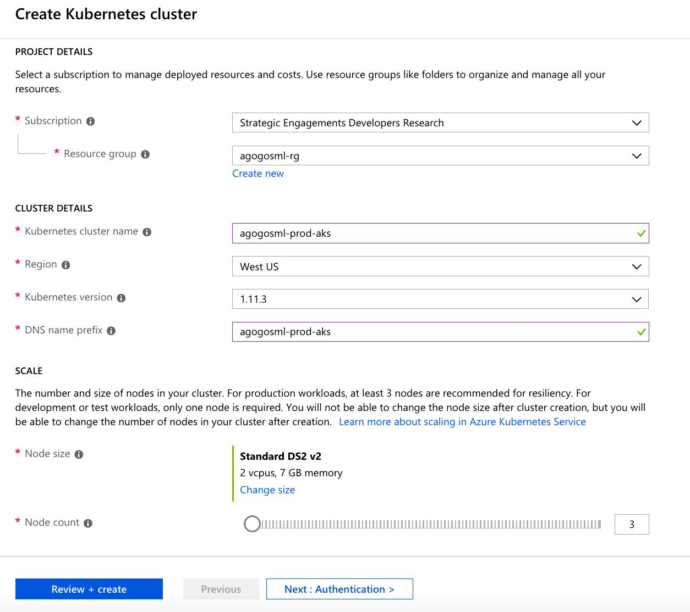
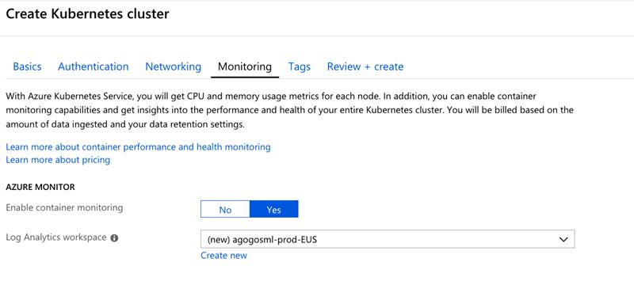

# Setup Test Environment

## Create a Service Principal

- Create a new Service Principal on Azure using [azure cli](https://docs.microsoft.com/en-us/cli/azure/create-an-azure-service-principal-azure-cli?toc=%2Fen-us%2Fazure%2Fazure-resource-manager%2Ftoc.json&bc=%2Fen-us%2Fazure%2Fbread%2Ftoc.json&view=azure-cli-latest) or [azure portal](https://docs.microsoft.com/en-us/azure/azure-resource-manager/resource-group-create-service-principal-portal?view=azure-cli-latest)
- Assign the new Service Principal with [Contributor Role]
(https://docs.microsoft.com/en-us/azure/azure-stack/azure-stack-create-service-principals#assign-role-to-service-principal) so it can access resources on your subscription. This Service Principal will be assigned to Kubernetes to enable it to create and manage its own resources, as well as push build artifacts into Azure Container Registry.

## Create an Azure Container Registry

- Create a new [Azure Container Registry](https://docs.microsoft.com/en-us/azure/container-registry/container-registry-get-started-portal#create-a-container-registry)

## Create a Kubernetes Cluster

- Create a new resource group on your subscription
- Add a new resource and search for "Kubernetes Cluster"

- Define the resource group, cluster name and DNS

- Press "Next" and don't change any parameters in the authentication

- Press "Next" and leave monitoring as is

- Move on to "Review + Create" and wait for the validation process to complete

- Press "Create" to complete the process

